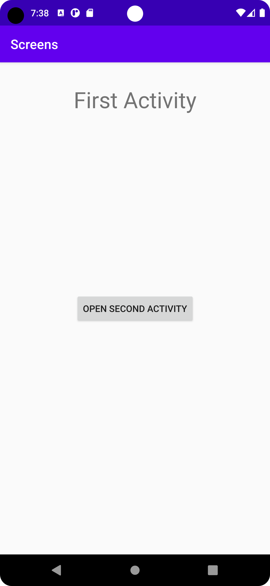
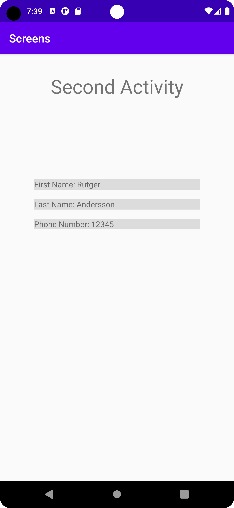

# Rapport

Det första jag gjorde var att lägga till en ny activity vilket enkelt går att göra i Android Studio genom att
navigera till File->New->Activity, där jag valde Empty Activity. För att skilja mellan mina två activities lade jag på 
vardera till en TextView som säger "First Activity" respektive "Second Activity". 

```
<TextView
    android:id="@+id/secondActivity"
    android:layout_width="wrap_content"
    android:layout_height="wrap_content"
    android:text="Second Activity"
    android:textAppearance="@style/TextAppearance.AppCompat.Display1"
    app:layout_constraintBottom_toBottomOf="parent"
    app:layout_constraintLeft_toLeftOf="parent"
    app:layout_constraintRight_toRightOf="parent"
    app:layout_constraintTop_toTopOf="parent"
    app:layout_constraintVertical_bias="0.048" />
```

Efter det var det dags att skapa en knapp som öppnar den andra aktiviteten, så då gick jag
först in och lade till en ButtonView på activity_main.

```
<Button
    android:id="@+id/button"
    android:layout_width="wrap_content"
    android:layout_height="wrap_content"
    android:text="Open Second Activity"
    app:layout_constraintBottom_toBottomOf="parent"
    app:layout_constraintLeft_toLeftOf="parent"
    app:layout_constraintRight_toRightOf="parent"
    app:layout_constraintTop_toTopOf="parent" />
```
Därefter skapade jag ett Button-objekt inuti MainActivity, som jag kopplade till min ButtonView
via metoden findViewById. Jag fäste därpå en OnClickListener på knappen, som kör koden inom sin metod onClick
varje gång knappen trycks. För att starta Activity2 behöver jag en intent, så jag går jag ner en bit och skapar metoden runActivity2, som jag kallar
på i onClick, i vilken jag skapar min intent. I dess constructor skickar jag med packageContext vilket är MainActivity, och en oinstansierad
Activity2.
Med min intent skickar jag också med data, ett förnamn, efternamn och telefonnummer, vilket görs med metoden putExtra. Constructorn
tar först en nyckel som används för att referera till datan följt av datan själv. För att slutligen starta aktiviteten kallar jag på
metoden startActivity och skickar med min intent.

```
Button button;

@Override
protected void onCreate(Bundle savedInstanceState) {
    super.onCreate(savedInstanceState);
    setContentView(R.layout.activity_main);
    button = findViewById(R.id.button);
    button.setOnClickListener(new View.OnClickListener() {
        @Override
        public void onClick(View view) {
        runActivity2();
        }
    });
    }
    
public void runActivity2() {
    Intent intent = new Intent(this, Activity2.class);
    intent.putExtra("firstName", "Rutger");
    intent.putExtra("lastName", "Andersson");
    intent.putExtra("telNumber", 12345);
    startActivity(intent);
}
```

Sedan går jag över till Activity2 för göra så den kan ta emot datan jag skickat. För att åstadkomma det skapar jag en instans av
Bundle kallad extras, på vilken jag via metoderna getIntent() och getExtras() fäster datan som skickats över. Med detta kan jag sedan
referera till varje enskild data med dess nyckel, och lagra de i varsinn variabel. En nullcheck sätts även på plats för att undvika 
en krasch i fall ingen data skulle ha skickats.

```
Bundle extras = getIntent().getExtras();
if (extras != null) {
    String firstName = extras.getString("firstName");
    String lastName = extras.getString("lastName");
    int telNumber = extras.getInt("telNumber");
}
```

Då återstod bara att visa upp datan på Activity2, så därför skapade jag varsinn TextView åt varje data. Jag tog även tillfälle
att ordna de på ett snyggt sätt på skärmen med hjälp av olika constraints vilket var lärorikt att experimentera med.

```
<TextView
    android:id="@+id/firstNameID"
    android:layout_width="0dp"
    android:layout_height="wrap_content"
    android:layout_marginStart="60dp"
    android:layout_marginLeft="60dp"
    android:layout_marginTop="140dp"
    android:layout_marginEnd="60dp"
    android:layout_marginRight="60dp"
    android:background="#DCDCDC"
    android:text="FirstName"
    app:layout_constraintEnd_toEndOf="parent"
    app:layout_constraintStart_toStartOf="parent"
    app:layout_constraintTop_toBottomOf="@+id/secondActivity" />
```


Efter det gick jag in i MainActivity och skapade objekt åt varje TextView. Under samma nullcheck som innan
definierade varje TextView med findViewById. Genom dessa kunde jag därpå sätta texten på varje View till att visa den data som skickats över.

```
firstNameView = findViewById(R.id.firstNameID);
lastNameView = findViewById(R.id.lastNameID);
telNumberView = findViewById(R.id.telNumberID);

firstNameView.setText("First Name: " + firstName);
lastNameView.setText("Last Name: " + lastName);
telNumberView.setText("Phone Number: " + telNumber);
```



